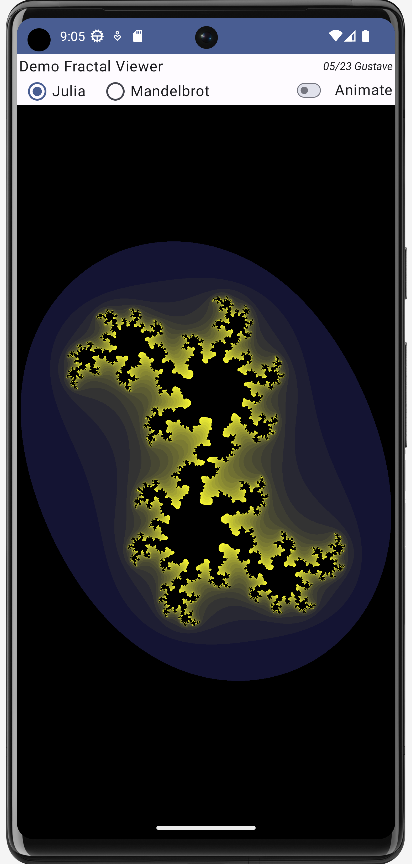
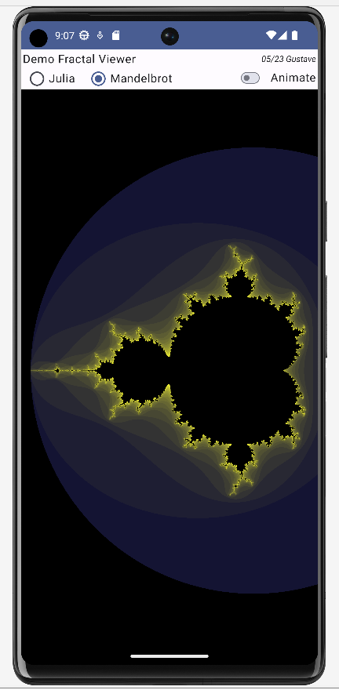
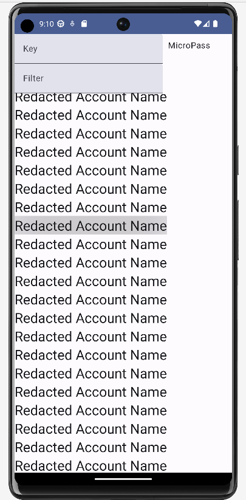

# phone-apps
Android Phone Apps to test out Kotlin and modern Android development

## Fractal
Renders simple fractals using Kotlin with a realtime OpenGL ES interior window

## MicroPass
A small password manager, ported over from the C# implementation at https://github.com/guminer/micropass with compatibility for the encrypted passwords from that C# implementation

